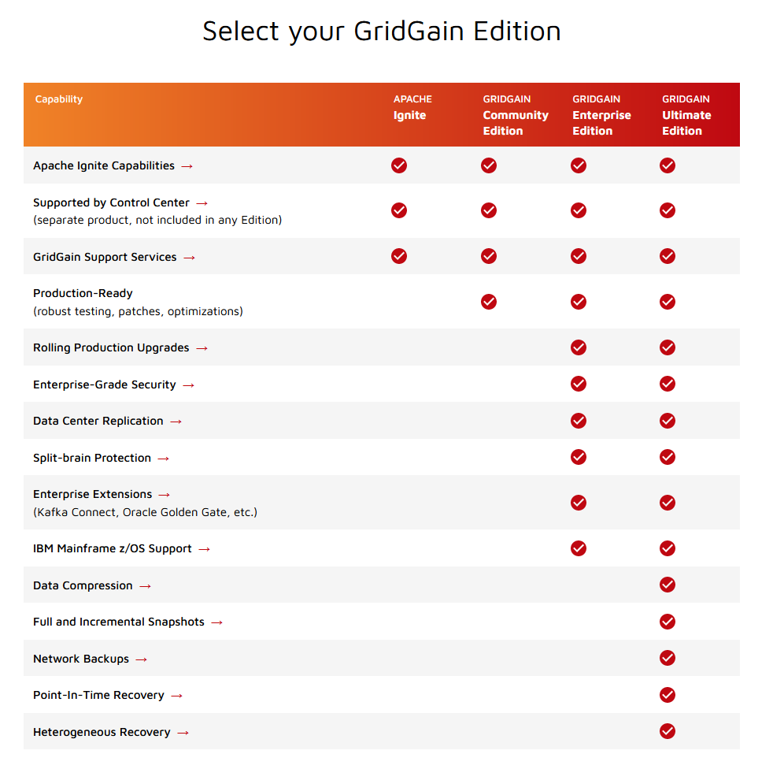

What is this?
================

I'm setting up production-like Apache Ignite clusters with Docker. From here I'll attempt test important things like:

- Native persistence
- Replication
- Partitioning
- Instance failures
- Net splits
- Entire availability zone failures

How?
=======

A shared Docker network and three main components:

- Shared network: `docker network create ignite-net`
- Ignite cluster A: `cd cluster-a; docker compose up -d`
- Ignite cluster B: `cd cluster-b; docker compose up -d`
- A simple Spring Boot console application that injects data and checks that data stays consistent: `cd app; mvn spring-boot:run`

Generally, run the app and have it create load and check future read results against its own accounting to find inconsistencies.
While this is happening, create various failures, add instances, remove instances, and so on as you would in production upgrades, zone evacuations, and more.

What did you discover?
=========================

The clusters were amazingly resilient and configurable. They seemed to perform very well in local tests and survived a great number of chaos tests while maintaining consistency.

In a few cases where I attempted to destroy and rebuild a node I would receive an error where the `consistentId` was already in use. I still don't understand why this happens. Perhaps because of a reused IP address or hostname?

I stopped the discovery process before testing net splits.

## Final decision?

The most critical feature _not provided_ by Apache Ignite is the complete inability to do even patch version rolling upgrades. You can try this yourself by simply bumping the version number in one of the clusters and then attempting to join them. Any nodes joining the cluster with version mismatch will be disconnected.

I did not end up testing net splits or deeper checks for split brain behavior because I hit a feature gap that I could not overlook.

This is not optional in a highly active production environment that requires little to no downtime. This feature requires at least GridGain Enterprise Edition.

## Important feature comparisons with GridGain products

See the chart below or click to see the official website.

